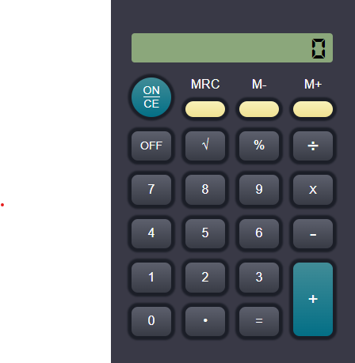

# Calculadora JavaScript

Uma calculadora funcional desenvolvida em HTML, CSS e JavaScript com uma interface amigável e suporte a operações matemáticas básicas e memória.

## Funcionalidades

- Operações matemáticas básicas (+, -, \*, /)
- Funções de memória (M+, M-, MRC)
- Função de raiz quadrada
- Função de porcentagem
- Suporte a números decimais
- Interface responsiva e animada

## Imagens

### Interface da Calculadora



## Uso

### Interface

A calculadora possui uma interface simples com os seguintes botões:

- **Números (0-9)**: Insira números.
- **Ponto (.)**: Adiciona um ponto decimal.
- **Operadores (+, -, \*, /)**: Realiza operações matemáticas.
- **=**: Calcula o resultado da operação atual.
- **√**: Calcula a raiz quadrada do número atual.
- **%**: Converte o número atual para porcentagem.
- **M+**: Adiciona o número atual à memória.
- **M-**: Subtrai o número atual da memória.
- **MRC**: Recupera ou limpa o valor da memória.
- **ON CE**: Liga a calculadora e limpa a tela.
- **OFF**: Desliga a calculadora.

### Operações

1. **Adicionar Números**: Clique nos botões numéricos ou use as teclas de 0 a 9 no teclado.
2. **Operações Matemáticas**: Selecione o operador desejado e, em seguida, clique no botão de igual (=) para obter o resultado.
3. **Uso da Memória**:
   - **M+**: Adiciona o valor atual à memória.
   - **M-**: Subtrai o valor atual da memória.
   - **MRC**: Mostra o valor armazenado na memória. Pressione novamente para limpar a memória.
4. **Funções Especiais**:
   - **√**: Calcula a raiz quadrada do número atual.
   - **%**: Converte o número atual em porcentagem.

### Teclado

Você também pode usar o teclado para interagir com a calculadora:

- Números (0-9)
- Ponto (.)
- Operadores (+, -, \*, /)
- Enter para calcular
- Escape para resetar

## Instalação

1. Clone este repositório:

```bash
git clone https://github.com/seu-usuario/calculadora-js.git
```

2. Navegue até o diretório do projeto:

```bash
cd calculadora-js
```

3. Abra o arquivo index.html em seu navegador.

## Tecnologias Utilizadas

- **HTML**: Estrutura básica da calculadora.
- **CSS**: Estilo e design, usando Tailwind CSS.
- **JavaScript**: Lógica da calculadora.
